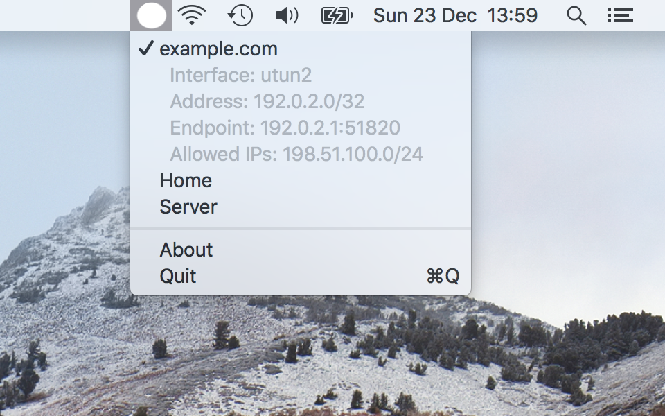

This is a macOS statusbar item (aka menubar icon) that wraps wg-quick.

# Features

- Sit in your menubar
- Indicate if tunnels are connected
- Bring tunnel up/down via one click
- Fail miserably when brew/wg-quick is not installed or permissions on files are incorrect

# Installation

- Follow the instruction to install WireGuard for macOS: https://www.wireguard.com/install/
- Create a tunnel configuration file (eg: `/usr/local/etc/wireguard/utun1.conf`)
- Make sure the file is readable by your user (`sudo chown :staff /usr/local/etc/wireguard/utun1.conf; sudo chmod g+r /usr/local/etc/wireguard/utun1.conf`)
- Download this App from [Releases](https://github.com/aequitas/macos-menubar-wireguard/releases)
- Open the .dmg and copy the Application to where you like (eg: /Applications)
- The next bit is needed because I don't have a Apple Developer account to properly sign the binary. If you don't like it consider building and signing the application yourself.
    - Start the App and get a dialog indicating the app is not signed
    - Go to: Preferences->Security & Privacy->General and click "Open Anyway"

# Todo/Readmap

- Tests!
- Tunnel connectivity status
- Error handling for when dependencies (wg-quick/brew) are missing or files cannot be read
- Move config file reading to privilegedhelper
- Bundle WireGuard (wireguard-go/wg-quick/bash4)
- Configuration editor
- Key management (via keychain)
- Prefpane?
- Start tunnels at startup
- Add application to startup items
- More tunnel statistics (privilegedhelper)
- Help menu
- Developer ID signing (costs €100/y)
- Update checking
